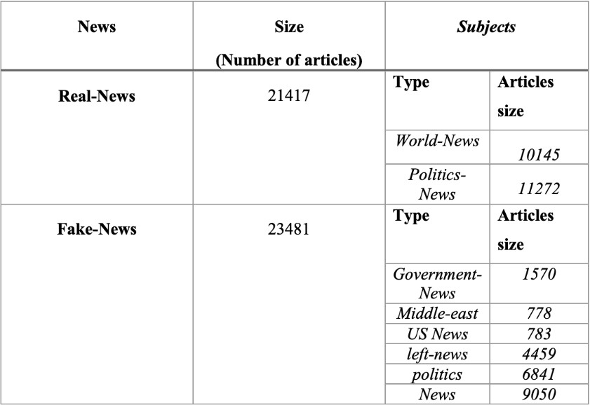

# 📰 Fake News Detector using NLP Techniques

## Authors
**Author 1**: [Kuba Czech](https://github.com/KubaCzech)
**Index Number**: 156035

**Author 2**: [Piotr Balewski](https://github.com/PBalewski)
**Index Number**: 156037

## Description

With misinformation spreading rapidly on social media, having lightweight tools to flag potentially fake content is crucial. This project implements a **Fake News Detection** system using **Natural Language Processing (NLP)** techniques. We explore multiple vectorization strategies and classification models to distinguish between real and fake news.

## 📂 Dataset

We use a publicly available dataset from Kaggle:\
[Fake News Detection Dataset by Emine Yetim](https://www.kaggle.com/datasets/emineyetm/fake-news-detection-datasets/data?select=News+_dataset)

Dataset consist off over 40k articles, below there is its characteristic:

## ⚙️ Project Structure

The core pipeline involves:

1. **Preprocessing**:

   - Lowercasing
   - Punctuation removal
   - Stopword removal
   - Tokenization
   - Lemmatization

2. **Text Vectorization Approaches**:

   - **Contextual Embeddings** using **DistilBERT**
   - **Static Word Embeddings** using **GloVe 50d** vectors
   - **TF-IDF (Term Frequency-Inverse Document Frequency)**

3. **Classification Models Tested** (for each vectorization method):

   - Support Vector Machine (SVM)
   - Logistic Regression (LR)
   - k-Nearest Neighbors (kNN)
   - Decision Tree
   - Random Forest
   - Custom Feedforward Neural Network (FNN)

## 📊 Evaluation Metrics

Each model was evaluated using the following metrics:

- **Accuracy**
- **Precision**
- **Recall**
- **F1 Score**
- **Confusion Matrix**

A comprehensive comparison of all models and approaches is presented at the bottom of the final report.

## 💻 Technologies Used

- Python 3.9+
- Scikit-learn
- Tensorflow, Torch
- Transformers (HuggingFace)
- NLTK, re
- Matplotlib (for visualization)

## 📘 Report

For a detailed walkthrough of the methodology, experiments, and findings, refer to the [`project.ipynb`](./project.ipynb).

## 📜 License

This project is licensed under the MIT License.

